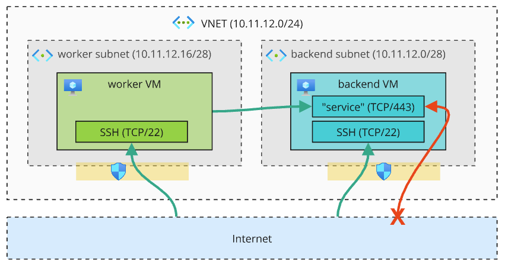

# IaC Challenge

In this challenge, you will create IaC code for the Azure virtual infrastructure described below using either Terraform or Azure Bicep (your choice). We will then review the code and discuss your approach during our interview session.

## Infrastructure to be created

The simple infrastructure consists of a virtual network with 2 separate subnets (`backend` and `workers`), and VMs connected to each of the 2 subnets. One of the VMs simulates a backend node with a fictional service listener on port 443 (setting up the service is NOT part of this challenge; we will just assume it is there). The other VM simulates a worker node that connects to the backend node to that port. Both VMs should be reachable via SSH through individual public IP addresses, and authorize SSH connections from the public SSH key listed below. Note that the service port 443 of the backend VM is NOT allowed to be exposed to the Internet.

### Infrastructure Details

1. The location of all resources must be based on the resource group in which the new resources are deployed to.
2. The IaC script must have parameters (specifiable by command line) for `appName` (default: `vent4cloud`) and `envName` (no default, but mandatory).
3. All worker and backend resources (VM, subnet, ...) must have unique names containing the `appName` and `envName`.
4. The VNET must have a unique name containing the `appName`.
5. The virtual network (VNET) address space must be `10.11.12.0/24`.
6. The backend subnet address space must be `10.11.12.0/28`.
7. The worker subnet address space must be `10.11.12.16/28`.
8. The two subnets must have individual network security groups (NSG's):

    - Both subnets must allow inbound SSH from anywhere (including the Internet).
    - The backend subnet NSG must allow inbound port 443 only from the VNET (but NOT from the Internet).

9. The configuration for both VMs is very basic:

    - A single network interface (connected to the subnet).
    - A dynamic public IP address (for SSH access from the Internet).
    - The admin user name should be `devops`.
    - Authorized SSH public key for the admin user: `ssh-rsa AAAAB3NzaC1yc2EAAAADAQABAAABgQDfiP5UoHT6+36MdmRIKwt4dFhVBdJMYG5gh6P2Zs3AcQhi8ipDzhPYJheuOwKUzxVDWBCYfcYyOwrBGmARxBjHIAxOLaNAcAZB/kbY/u641uQUgvyeTd/TqvFzjlmbjLlSxo8vzeZOrTHZAd2mE1W/bkYPVlznS+qGFe578uTByPZL4kRfUmRo5vM7n1Zn7dQaTXbsFElDByZAzDedqoBL0j1WReze+CJor4y5AFZubKloJNK4jebknqhj8iEHHbAdH/bn122nWrgbi9eKkhlxqR/HZKGd65ntVN8I9g5CzcLUcykGS5FvCdWK+tHvXZpHeAZ22roEgQ/s9ixKDS1Gh97l1SrV2ZjqWs5B+jWfHvZk/uY403Kwyg2nntT67Wx7x+/Fauq6oFBj1Sval3W1RdAXKhxRfi1u3PJ3erXwWD1H0xwPPMHNxQitdYXQVAq7CU7KX8loSVlPUt/VwSCDmnLw8CZXYiGgEwB2PgwpRZxfq3JRnbDf8LxjIBy807k=`.
    - The VM size must be `Standard_B1ls`.

## Your Tasks

1. Author the IaC file(s) using either Terraform or Bicep. Parameterize them as much as reasonable and store them in this repository.
2. Write down (in a separate file in this repo) the command required to deploy the IaC file(s) to Azure. The deployment should target the environment name (`envName`) `qa` to the existing resource group `devops-interview`.
3. During the interview session, you will guide us through the code and elaborate on your thoughts and decisions.

> NOTE: There's no single right or wrong solution. Of course the code should work, but generally we are interested in learning how you approach this challenge.

## Questions & Contact

If there are questions or some things are unclear, make a decision based on your best guess and take a note. If you get stuck and you need to talk to be before the Interview session, feel free to send me an [email](mailto:seggenschwiler@hamilton-medical.com) or [chat with me on Teams](https://teams.microsoft.com/l/chat/0/0?users=seggenschwiler@hamilton-medical.com).

Have fun, good luck and looking forward to talk soon!  
_Stefan & the Digital Solutions Dev Team_
